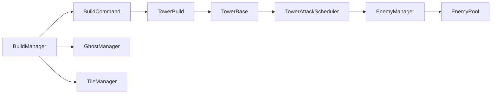
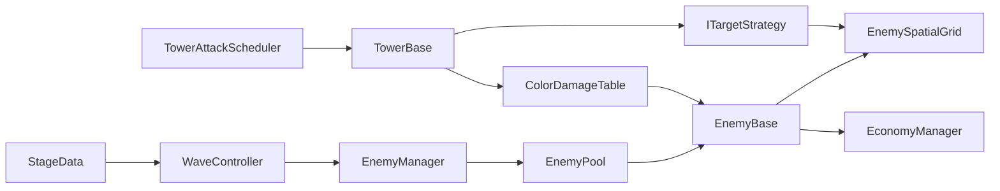

# LebaTein

> 색상 상성, 그리드 건설, 대규모 웨이브 처리를 중심으로 제작 중인 Unity 기반 전략 타워 디펜스 프로젝트.

**Portfolio Polish Status:** 3주 개선 작업 진행 예정  
**Engine:** Unity 6000.3.4f1  
**Genre:** Strategy / Tower Defense

📄 **[상세 기획서 — Google Docs](https://docs.google.com/document/d/1NOhl0Zz-ZHif_uDQGmxbX08JtxK7_TpaP-FgKAFrGdU/edit)**

---

## Project Goal

LebaTein은 단순히 타워 종류를 늘리는 것보다 **색상 상성**, **배치 판단**, **대규모 적 처리 구조**를 명확하게 보여주는 것을 목표로 한다.

3주 개선 작업에서는 기존 프로토타입을 유지하면서 다음 네 가지를 포트폴리오 핵심으로 정리한다.

- Color Combat System
- Grid Build System
- Data Driven Wave / Unit System
- Object Pooling + Batched Update + Spatial Partitioning

최종 목표는 **1 Stage / 10 Wave / 8~12분 분량의 완성된 플레이 루프**다.

---

## Current Implementation

현재 저장소에 구현되어 있는 기반 시스템이다.

### Build

- 10 × 10 Grid 기반 배치
- Unit 점유 여부 검사
- Build State 관리
  - Idle
  - Preview
  - Placing
  - Cancelled
- BuildCommand 기반 설치 흐름
- Ghost Preview
- 설치 가능 / 불가능 Material 표시
- 타워 90도 회전
- Tile / Tower Build 분리
- Interface를 이용한 Build Context / Grid Query / Preview 의존성 분리

### Tower

- TowerBase
- ScriptableObject 기반 TowerData
- ColorType 적용
- 공격 범위
  - Circle
  - Box
  - Cone
- 공격 방식
  - Single
  - Area
- TowerAttackScheduler를 통한 분산 업데이트

### Enemy

- EnemyManager
- List + Dictionary 기반 Enemy 등록 관리
- Swap Remove 방식 Unregister
- EnemyPool
- Warm Pool
- Pool Size 제한
- 필요 시 확장 가능

### Scene / UI

- Loading
- Title
- Game
- 비동기 Scene Loading
- UI Screen 등록 / 전환 구조

---

## 3-Week Portfolio Plan

### Week 1 — Game Loop

- [ ] TowerAttackScheduler 시간 처리 수정
- [ ] TowerData / EnemyData 구조 정리
- [ ] Enemy 이동 / Path / Goal
- [ ] Base HP / Game Over
- [ ] WaveData / StageData / WaveController
- [ ] Gold / Build Cost / Kill Reward
- [ ] Color Damage
- [ ] Tile Resonance

### Week 2 — Combat & Architecture

- [ ] Needle Tower
- [ ] Brush Tower
- [ ] Prism Tower
- [ ] Normal / Runner / Tank
- [ ] Upgrade / Sell
- [ ] Nearest / First / Strongest Target Strategy
- [ ] EnemySpatialGrid
- [ ] Pool + Scheduler + Spatial Grid Stress Test

### Week 3 — Polish & Portfolio

- [ ] HUD
- [ ] Tower Detail UI
- [ ] Range Preview
- [ ] Wave Preview
- [ ] Combat VFX / SFX
- [ ] Tutorial Overlay
- [ ] Balance / QA
- [ ] Profiler Before / After
- [ ] Architecture Diagram
- [ ] Windows Release Build
- [ ] Gameplay GIF / Video
- [ ] README Final Pass

세부 일정과 완료 기준은 **[상세 기획서](https://docs.google.com/document/d/1NOhl0Zz-ZHif_uDQGmxbX08JtxK7_TpaP-FgKAFrGdU/edit)** 에서 관리한다.

---

## Core Combat Design

### Color Advantage

| Attack Color | Advantage |
| --- | --- |
| Red | Green |
| Green | Red |
| Orange | Blue |
| Blue | Orange |
| Yellow | Purple |
| Purple | Yellow |
| White | None |

예정 피해 배율:

- 보색 공격: **×1.5**
- 일반 공격: **×1.0**
- 동일 색상 공격: **×0.6**
- White: **×1.0**

### Tile Resonance

타워 색상과 설치된 Tile 색상이 같으면 공격력 보너스를 받는다.

**1차 기준: Damage +15%**

색상은 단순 Material 변경이 아니라 다음 판단을 연결하는 핵심 규칙으로 사용한다.

```text
Enemy Color
     ↓
Tower Color
     ↓
Tile Color
     ↓
Damage / Resonance
```

---

## Architecture

### Current



### Planned Combat Flow



---

## Optimization

### Object Pooling

Enemy 생성 / 파괴 반복을 줄이기 위해 EnemyType별 Pool을 사용한다.

현재 구현:

- Warm Count
- Maximum Pool Size
- Expand Option
- Sleep / Live Root 분리
- Spawn / Despawn Hook

### Enemy Registry

활성 Enemy는 `List<EnemyBase>` 와 `Dictionary<int, int>` 를 함께 관리한다.

삭제 시 마지막 Enemy와 교체하는 방식으로 List 중간 삭제 비용을 줄였다.

### Tower Attack Scheduler

각 Tower가 매 Frame 독립적으로 전체 공격 로직을 실행하지 않고 Scheduler가 일정 수씩 나누어 갱신한다.

3주 개선 과정에서는 Scheduler의 **검사 분산**은 유지하되, 타워 수 증가가 공격 쿨타임에 영향을 주지 않도록 실제 시간 기준으로 공격 타이밍을 분리한다.

### Spatial Partitioning — Planned

현재 Tower Target Search는 활성 Enemy 목록을 순회한다.

개선 후에는 Enemy를 Cell 단위로 관리해 공격 범위 주변의 후보만 조회한다.

```text
Before
Tower × All Active Enemies

After
Tower × Nearby Cell Candidates
```

최종 README에는 동일 조건의 **Profiler Before / After** 측정 결과를 추가한다.

---

## Portfolio Scope

### Must Have

- 완성된 Start → Play → Result 흐름
- 10 Wave
- Color Combat
- Tile Resonance
- Gold / Base HP
- 3 Towers
- 3 Enemies
- Data Driven Wave
- Pooling
- Scheduler
- HUD / Result UI
- Release Build

### If Time Allows

- Spatial Grid
- Upgrade / Sell
- Target Strategy
- Chromatic Elite
- Tutorial Overlay

### Out of Scope

- Multiplayer
- DOTS 전환
- Procedural Generation
- Roguelike Meta Progression
- Multi Stage
- Inventory
- Stage Editor

---

## Key Source

| Area | Source |
| --- | --- |
| Build Flow | [BuildManager.cs](Lebatain/Assets/Scripts/Manager/BuildManager.cs) |
| Build Command | [BuildCommand.cs](Lebatain/Assets/Scripts/Base/BuildCommand.cs) |
| Ghost Preview | [GhostManager.cs](Lebatain/Assets/Scripts/Manager/GhostManager.cs) |
| Grid | [TIleManager.cs](Lebatain/Assets/Scripts/Manager/TIleManager.cs) |
| Tower | [TowerBase.cs](Lebatain/Assets/Scripts/Base/TowerBase.cs) |
| Tower Scheduler | [TowerAttackScheduler.cs](Lebatain/Assets/Scripts/Manager/TowerAttackScheduler.cs) |
| Enemy Registry | [EnemyManager.cs](Lebatain/Assets/Scripts/Manager/EnemyManager.cs) |
| Enemy Pool | [EnemyPool.cs](Lebatain/Assets/Scripts/Systems/EnemyPool.cs) |
| Tower Data | [TowerData.cs](Lebatain/Assets/Scripts/Data/TowerData.cs) |

---

## Portfolio Deliverables

완료 시 아래 자료를 저장소에 추가한다.

- Gameplay GIF
- 30~60초 플레이 영상
- Architecture Diagram
- Profiler Before / After
- Trouble Shooting 2~3건
- Windows Release Build
- 핵심 코드 설명

---

<details>
<summary>Early Development Log</summary>

### ~ 02.03

- Grid
- DIP / DI 일부 적용
- 구조 리팩토링
- Ghost
- Tile 관련 도구

### 02.04 ~ 02.05

- TowerBase
- Tower 설치
- Tower Stat
- Tower 종류 기반 작업

### 이후

- Enemy 기반 구조
- Object Pooling
- Scene 개선
- Tower Range
- Tower Attack Scheduler

</details>
